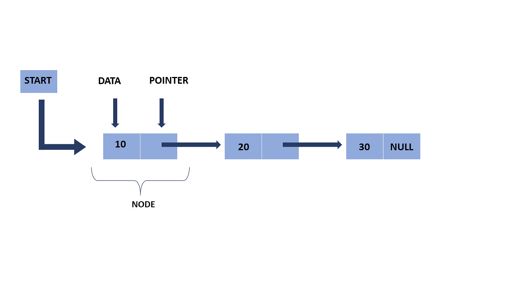

Neste artigo, apresentarei uma reflexão sobre por que a linked list (lista encadeada ou ligada) é uma otimização, também humana, surgindo da necessidade de resolver problemas. Primeiramente, abordarei seu funcionamento e explicarei por que ela se destaca como uma solução eficaz quando lidamos com estruturas que demandam facilidade na adição e remoção de elementos.

Quando penso em linked list, um exemplo ilustrativo que me vem à mente é o jogo do telefone sem fio. Nessa brincadeira, a informação é passada de forma sequencial, semelhante ao funcionamento de uma lista encadeada. Cada participante conhece apenas o próximo da lista, criando uma sequência de conexões. Essa analogia pode ser visualizada da seguinte forma:

A primeira pessoa não consegue se comunicar diretamente com a terceira, e vice-versa. A primeira pessoa conhece apenas a segunda, e assim por diante. Esse contexto, exemplificado de maneira lúdica, reflete o funcionamento da linked list, onde cada nó representa uma posição na memória que conhece o próximo nó da lista. No entanto, a terminologia "nó" pode não ser totalmente esclarecedora, razão pela qual incluí uma imagem explicativa abaixo:
    
 

Essa analogia busca facilitar a compreensão do conceito. Refleti sobre essa abordagem no passado, e espero que ela seja útil para quem busca entender os princípios da linked list. Essa estrutura não é meramente uma forma de organizar dados, mas sim uma solução para desafios cotidianos. Ao ouvir alguém discutindo sobre linked lists, é importante perceber que a conversa vai além do conhecimento técnico da ferramenta. Ela envolve uma discussão sobre otimização e reflexão a partir dessa abordagem específica.